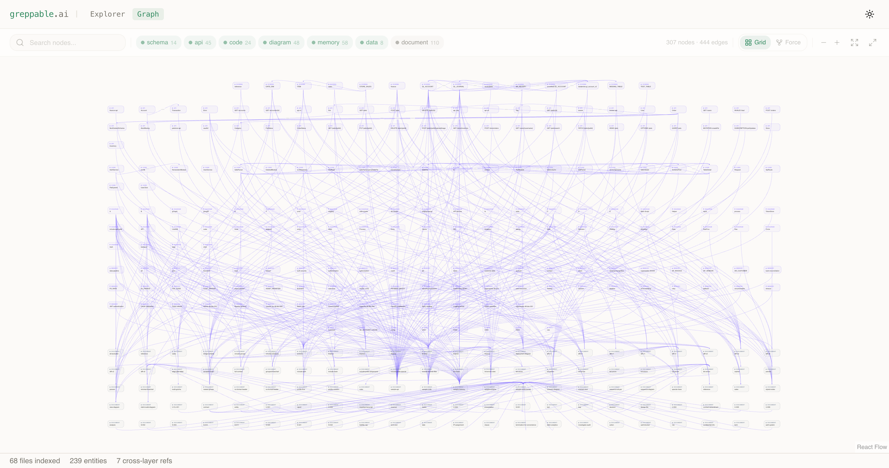
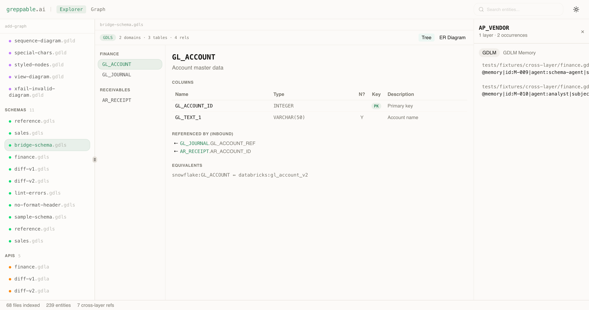
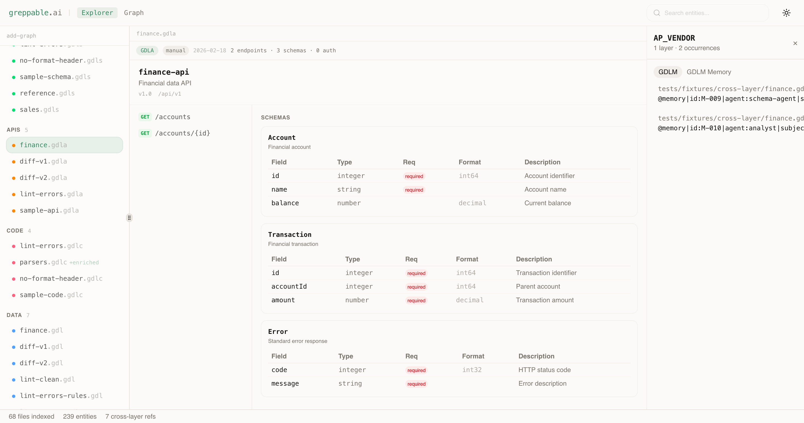
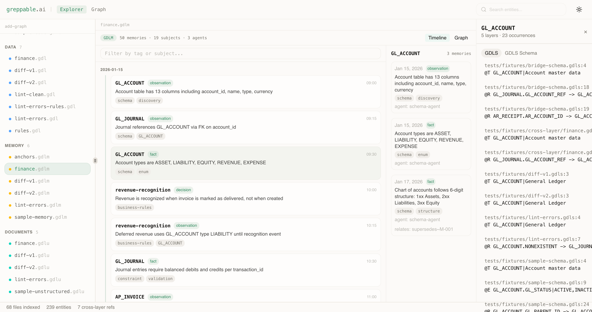
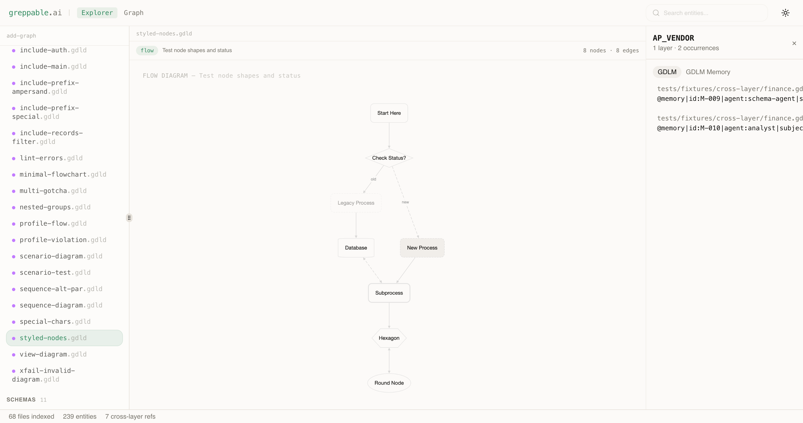

# greppable-explorer

[](https://greppable.ai)
[](LICENSE)
[](https://github.com/greppable/spec)
[](https://nodejs.org)

Visual explorer for [GDL](https://github.com/greppable/spec) (Grep-native Data Language) projects. Built by [greppable.ai](https://greppable.ai).

### Knowledge Graph


### Schema Browser (GDLS)


### API Contracts (GDLA)


### Memory Timeline (GDLM)


### Flowchart Diagrams (GDLD)


Point it at any repo with `.gdl*` files and get:
- **File browser** — all GDL files grouped by format
- **Format-specific rendering** — graphs, grids, schema trees, knowledge maps
- **Knowledge graph** — interactive entity graph with search, type filters, and force/grid layouts
- **Cross-layer linking** — click any entity to see where it appears across all layers

## Quick Start

```bash
cd your-project-with-gdl-files
npx greppable-explorer
```

Opens at `http://127.0.0.1:4321`.

## Options

```bash
npx greppable-explorer --port=3000           # Custom port
npx greppable-explorer --root=/path/to/project  # Explicit project root
```

## Development

```bash
git clone https://github.com/greppable/greppable-explorer.git
cd greppable-explorer
npm install
GDL_ROOT=/path/to/project npm run dev
```

## Views

Toggle between **Explorer** and **Graph** in the toolbar:

- **Explorer** — file tree sidebar with format-specific viewers and cross-layer entity panel
- **Graph** — interactive knowledge graph showing all entities and their relationships across GDL layers, with search, type filters, and switchable grid/force layouts

## Supported Formats

| Format | Extension | What it shows |
|--------|-----------|---------------|
| GDL | `.gdl` | Data grid with sortable columns |
| GDLS | `.gdls` | Schema tree with table/column browser |
| GDLC | `.gdlc` | Code structure with module dependencies |
| GDLA | `.gdla` | API contracts with endpoint details |
| GDLM | `.gdlm` | Knowledge graph with timeline view |
| GDLD | `.gdld` | Flowcharts and sequence diagrams (Cytoscape) |
| GDLU | `.gdlu` | Document index with section navigation |

## Notes

- First `npx` run downloads dependencies (~510MB). Subsequent runs use npm cache and are near-instant.
- Requires Node.js 18+.
- Binds to `127.0.0.1` only (localhost) — not exposed to network.

## License

[MIT](LICENSE)
