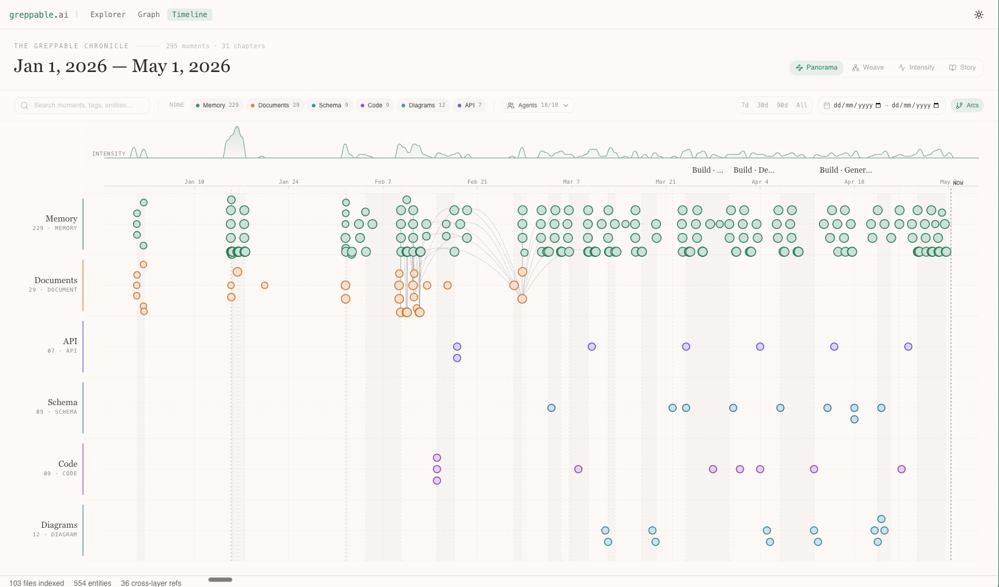
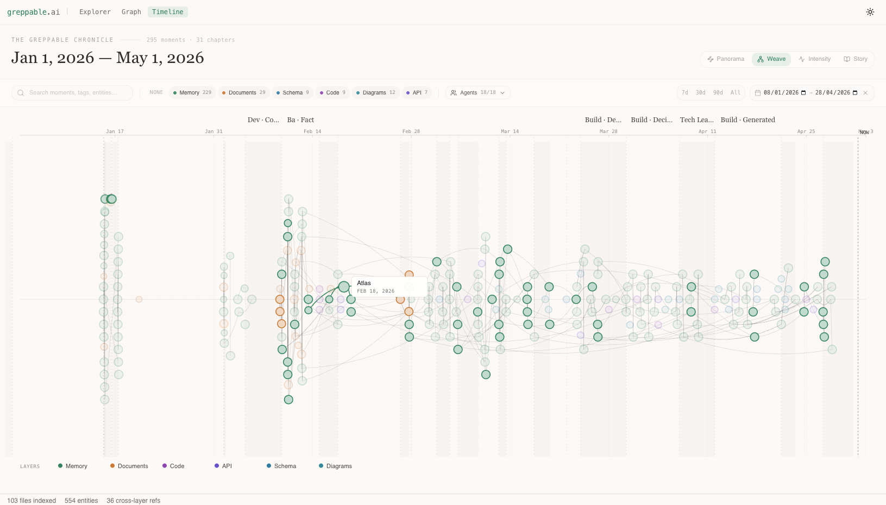
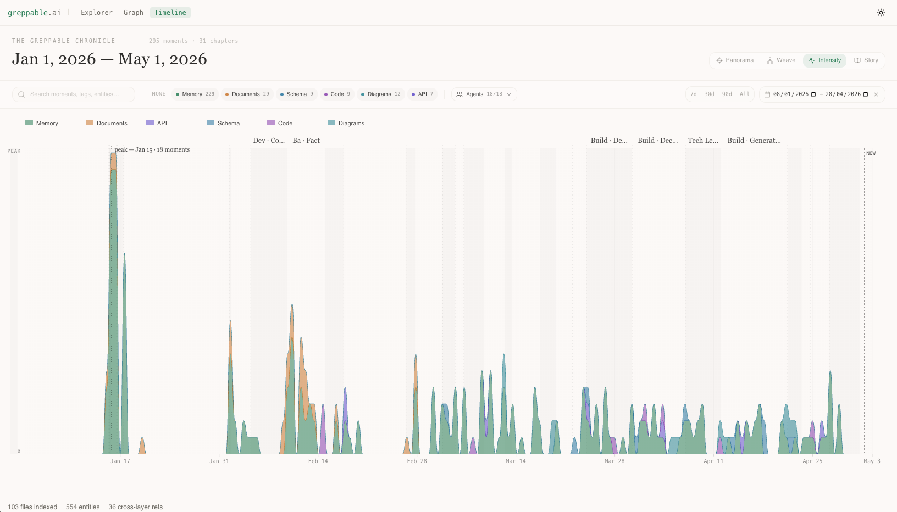

# greppable-explorer

[](https://greppable.ai)
[](LICENSE)
[](https://github.com/greppable/spec)
[](https://nodejs.org)

Visual explorer for [GDL](https://github.com/greppable/spec) (Grep-native Data Language) projects. Built by [greppable.ai](https://greppable.ai).

### Knowledge Graph


### Schema Browser (GDLS)


### API Contracts (GDLA)


### Memory Timeline (GDLM)


### Flowchart Diagrams (GDLD)


### The Greppable Chronicle — Timeline

A unified timeline view that aggregates every dated GDL record across the project (memories, source documents, file version headers, dated diagrams) into one event stream. Phases are auto-detected from gap clustering plus agent-family shifts. Search, layer chips, agent filter, date-range presets and wheel-to-zoom apply to all views.

#### Panorama
Horizontal swim lanes per layer with phase bands, an intensity ribbon at the top, beeswarm-packed event nodes and faint cross-layer arcs that connect events sharing entities.



#### Weave
Single-river layout where every event sits on one centerline. Bezier threads alternate above and below the line, weaving connections between events that share entities.



#### Intensity
Full-pane stacked area chart of activity per layer over time. Each colored stream shows where the project's energy was going on any given day. Peak day is annotated; hover the chart for a per-layer breakdown.



#### Story
Editorial longread layout (not pictured): resizable Contents sidebar with chapter scroll-spy; chapter heroes set in Newsreader serif; per-day marginalia with a 24-hour rhythm sparkline, agents on deck and top themes; pull-quote treatment for high-confidence decisions.

Point it at any repo with `.gdl*` files and get:
- **File browser** — all GDL files grouped by format, with an opt-in folder-path toggle for disambiguating same-name files
- **Format-specific rendering** — graphs, grids, schema trees, knowledge maps
- **Knowledge graph** — interactive entity graph with search, type filters, and force/grid layouts. **Adaptive scaling** — projects above 200 entities get a three-way **Recent / Clusters / All** toggle so the graph stays performant without losing detail
- **The Greppable Chronicle** — four-view timeline (Panorama / Weave / Intensity / Story) over every dated record across the project
- **Cross-layer linking** — click any entity to see where it appears across all layers
- **Cross-view jump** — source rows in any detail panel open the file in the Explorer
- **Resizable detail panels** across explorer, graph and timeline

## Quick Start

```bash
cd your-project-with-gdl-files
npx greppable-explorer
```

Opens at `http://127.0.0.1:4321`.

## Options

```bash
npx greppable-explorer --port=3000           # Custom port
npx greppable-explorer --root=/path/to/project  # Explicit project root
```

## Development

```bash
git clone https://github.com/greppable/greppable-explorer.git
cd greppable-explorer
npm install
GDL_ROOT=/path/to/project npm run dev
```

## Views

Toggle between **Explorer**, **Graph** and **Timeline** in the toolbar:

- **Explorer** — file tree sidebar with format-specific viewers and cross-layer entity panel
- **Graph** — interactive knowledge graph showing all entities and their relationships across GDL layers, with search, type filters, switchable grid/force layouts, and adaptive Recent / Clusters / All scaling for large projects
- **Timeline** — the Greppable Chronicle, with four sub-views (Panorama / Weave / Intensity / Story) over every dated record in the project

## Supported Formats

| Format | Extension | What it shows |
|--------|-----------|---------------|
| GDL | `.gdl` | Data grid with sortable columns |
| GDLS | `.gdls` | Schema tree with table/column browser |
| GDLC | `.gdlc` | Code structure with module dependencies |
| GDLA | `.gdla` | API contracts with endpoint details |
| GDLM | `.gdlm` | Knowledge graph with timeline view |
| GDLD | `.gdld` | Flowcharts and sequence diagrams (Cytoscape) |
| GDLU | `.gdlu` | Document index with section navigation |

## Notes

- First `npx` run downloads dependencies (~510MB). Subsequent runs use npm cache and are near-instant.
- Requires Node.js 18+.
- Binds to `127.0.0.1` only (localhost) — not exposed to network.

## License

[MIT](LICENSE)
