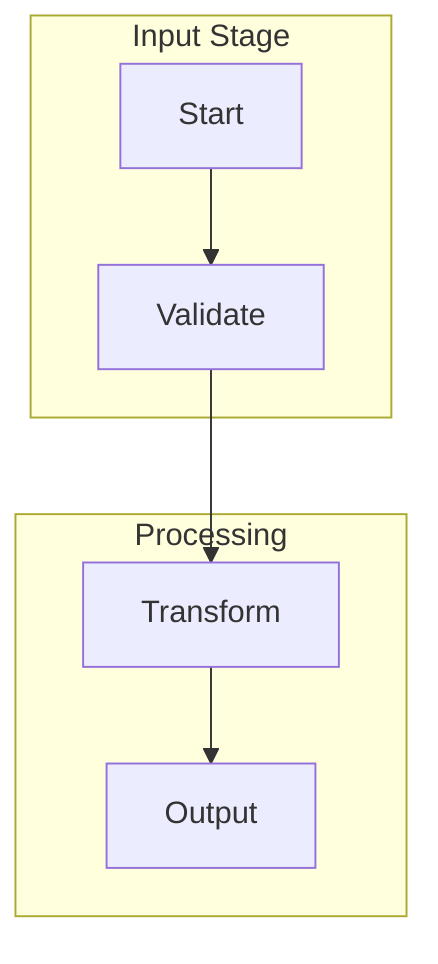

# Test with subgraphs

> Test with subgraphs

## Diagram

```mermaid
flowchart TD
    subgraph input["Input Stage"]
        A["Start"]
        B["Validate"]
    end
    subgraph process["Processing"]
        C["Transform"]
        D["Output"]
    end
    A --> B
    B --> C
    C --> D
```

