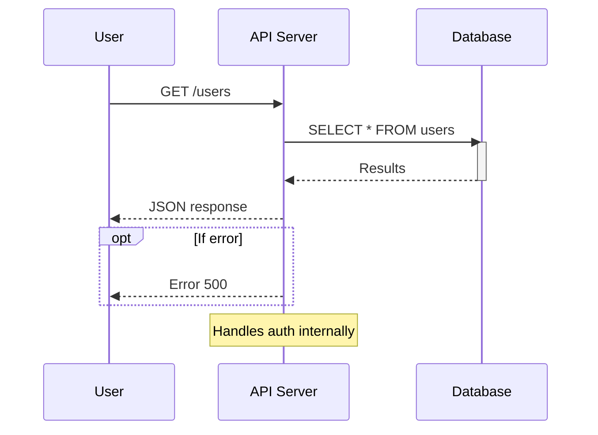

# Test sequence diagram generation

> Test sequence diagram generation

## Diagram

```mermaid
sequenceDiagram
    participant user as User
    participant api as API Server
    participant db as Database
    user->>api: GET /users
    api->>db: SELECT * FROM users
    activate db
    db-->>api: Results
    deactivate db
    api-->>user: JSON response
    opt If error
    api-->>user: Error 500
    end
    note over api: Handles auth internally
```

