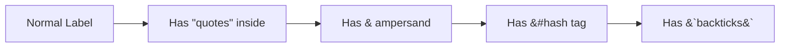

# Test special character handling

> Test special character handling

## Diagram

```mermaid
flowchart LR
    A["Normal Label"]
    B["Has &quot;quotes&quot; inside"]
    C["Has &amp; ampersand"]
    D["Has &#35;hash tag"]
    E["Has &#96;backticks&#96;"]
    A --> B
    B --> C
    C --> D
    D --> E
```

