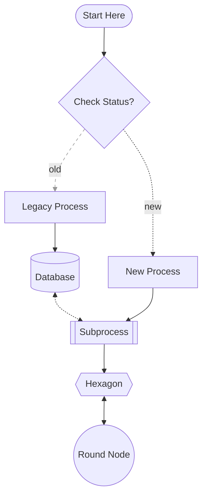

# Test node shapes and status

> Test node shapes and status

## Diagram

```mermaid
flowchart TD
    Start(["Start Here"])
    Decision{"Check Status?"}
    OldWay["Legacy Process"]:::deprecated
    NewWay["New Process"]:::planned
    Data[("Database")]
    SubProc[["Subprocess"]]
    Hex{{"Hexagon"}}
    Circle(("Round Node"))
    Start --> Decision
    Hex <--> Circle
    Data <-.-> SubProc
    Decision -->|"old"| OldWay
    Decision -.->|"new"| NewWay
    OldWay --> Data
    NewWay --> SubProc
    SubProc --> Hex
    linkStyle 3 stroke:#999,stroke-dasharray:5
```

